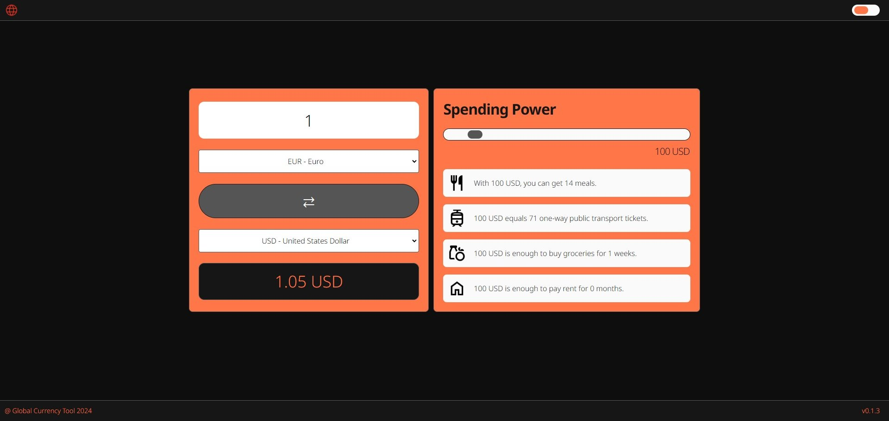

# Global Currency Tool

## Overview

Euro Converter is a web application that provides real-time updates on the conversion rate of different world currencies. It also includes a spending power feature that allows users to see how much they can buy in different countries with a given amount of money.

## Live Demo

→ [Global Currency Tool](https://pedroalves-dv.github.io/global-currency-tool/)



## Features

- Real-time currency conversion rates 🌎
- Spending power calculation based on cost of living indices 💰
- Dark mode toggle for better user experience 🌙
- Responsive design for mobile and desktop devices 📱💻

## Technologies Used

- React 
- TypeScript 
- SCSS 
- Vite 
- Open Exchange Rates API

## Installation

To run this project locally, follow these steps:

1. Clone the repository:

   ```sh
   git clone https://github.com/your-username/euro-converter.git

   ```

2. Navigate to the project directory:

```sh
   cd euro-converter
```

3. Install dependecies:

```sh
   npm install
```

4. Start the development server:

```sh
   npm run dev
```

5. Open your browser and navigate to:

```sh
 http://localhost:3000
```

## Contributing

Contributions are welcome! If you have any suggestions or improvements, please create a pull request or open an issue.
