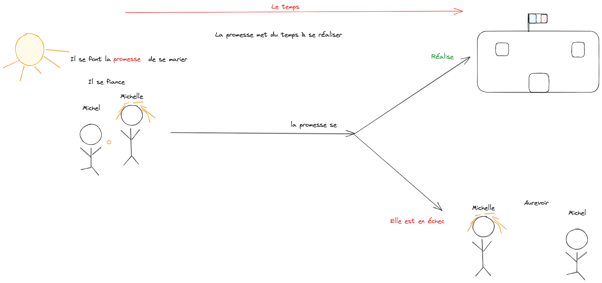

# Promise



On en retrouve :

- dans les `fetch`
- dans les requêtes en bdd
- ...

## Définition

C'est une action qui va être réaliser et qui va prendre du temps.
L'idée est que pendant ce temps, notre affichage, notre code ne soit pas bloquer.

On va attendre que la promesse s'accomplise que ce soit pour le meilleur ou pour le pire.

## Syntaxe

### then / catch / finally

```ts
// J'appel mon API, je récupère une promesse
fetch('...')
  // J'attend l'accomplissement de ma promesse avec succès
  .then((response) => {
    // Quand c'est finis, je réalise mon action
    // Dans le cas du fetch, je vais retourne la promesse du response.json
    return response.json();
  })
  .then((data) => {
    // Quand le response.json est finis, je réalise mon action
    console.log(data);
  })
  // Dans le cas où ma promesse serait en échec
  .catch((err) => {
    // Je réalise mon action
    console.log(err);
  })
  // Finalement, que ça ce soit bien passé ou pas...
  .finally(() => {
    // Je réalise mon action
    console.log('fin');
  });
```

### async / await

Le `await` ne peut se faire QUE dans une fonction async.

```ts
// Pas possible
await fetch('...');
```

```ts
// async function callApi() {

// }
const callApi = async () => {
  try {
    // J'appel mon API avec fetch et j'attend qu'on me reponde avec le await
    const response = await fetch('...');
    // J'attend que le response.json soit finis pour récupérer mes données
    const data = await response.json();
  } catch (error) {
    // EN cas d'erreur, la promesse à été rompu
    console.error(error);
  } finally {
    // Dans tous les cas, je réalise mon action
    console.log('fin');
  }
};
callApi();
```
